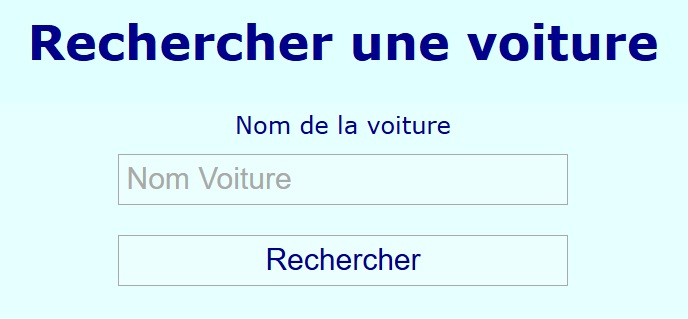

# Rechercher une voiture.

Le fichier **index.html** lcontient un formulaire de recherche dont le fonctionnement prévu est le suivant : 

1. L'utilisateur saisit un terme de recherche.
2. L'utilisateur clique sur le bouton "Rechercher":
3. Le programme recherche des correspondances dans la collection JSON "data/cars.json".
4. Le programme affiche le résultat de la recherche dans le div ayant pour identifiant "result".
    - Pour chaque voiture correspondant à la recherche afficher: id, nom, année, pays d'origine. 

## Travail à réaliser

- Implémenter les fonctionnalités dans le fichier **main.js**.
- Implémenter ensuite le code CSS dans le fichier **style.css** pour que la page corresponde à la maquette (fichier maquette.jpg).
    - Pour les résultats de la recherche, soyez créatif :)

